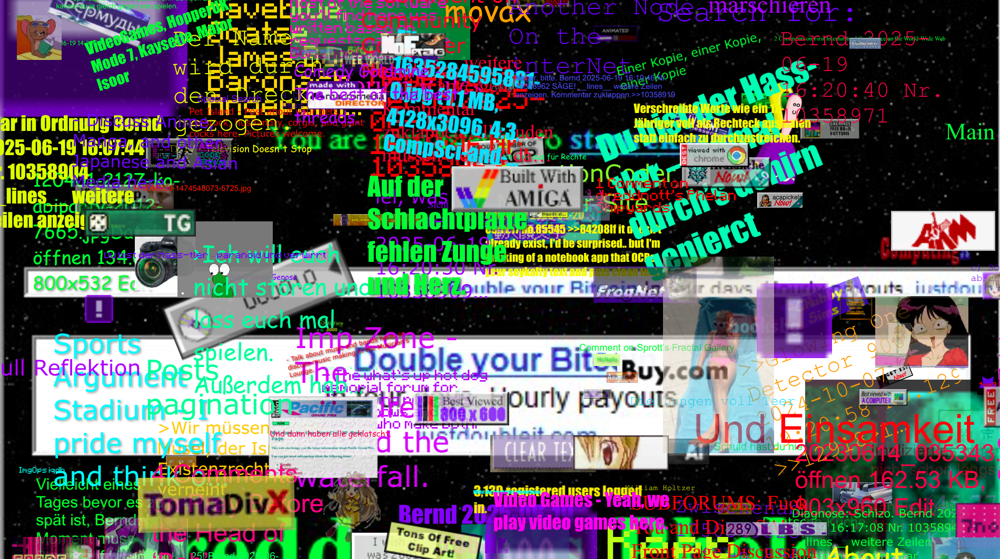

<div align="center">
  
</div>

[](https://github.com/yourusername/weirdweb)
[](http://www.MIT.net/)
[](https://weirdweb.isaweye.ink)

WeirdWeb creates unpredictable web experiences by scraping and combining content from various sources. The result is a constantly changing, chaotic web environment. 🌀

## 🌀 Features

- 🌐 Content scraping from diverse sources
- 🎨 Randomized visual compositions
- ⚡ Dynamic effects (rotation, scaling, shadows)
- 🖼️ Multi-layered layouts
- 🐳 Docker support for easy deployment

## 🚀 Quick Start

1. Clone the repository:
   ```bash
   git clone https://github.com/yourusername/weirdweb.git
   cd weirdweb
   ```

2. Install dependencies:
   ```bash
   npm install
   ```

3. Configure your sources in `config.yml` (examples included)

4. Run the server:
   ```bash
   node server.js
   ```

5. Open in browser: http://localhost:3000

### 🐳 Docker Setup

1. Build and run the container:
   ```bash
   docker-compose up --build
   ```

2. For background mode:
   ```bash
   docker-compose up -d
   ```

3. Stop the container:
   ```bash
   docker-compose down
   ```

4. View logs:
   ```bash
   docker-compose logs -f
   ```

Application will be available at: http://localhost:3000

## 🧩 How It Works

1. **Scraping**: Downloads images, GIFs, text, and fonts from configured sources
2. **Composition**: Creates multi-layered layouts with random positioning
3. **Effects**: Applies visual transformations to elements
4. **Display**: Generates a unique chaotic web experience on each load

## 🔧 Configuration

Edit `config.yml` to customize:
- `scrape-targets`: Websites to scrape content from
- `effect-chances`: Probability of visual effects
- `layer-settings`: Number of layers and assets per layer
- `asset-sources`: Direct URLs for specific asset types

## 📸 Screenshots



## 📜 License

This project is licensed under the MIT License - feel free to use it however you want.

## 🤝 Want to contribute?

1. Fork the repository
2. Make your changes
3. Submit a pull request
4. Embrace the chaos! 🌪️
